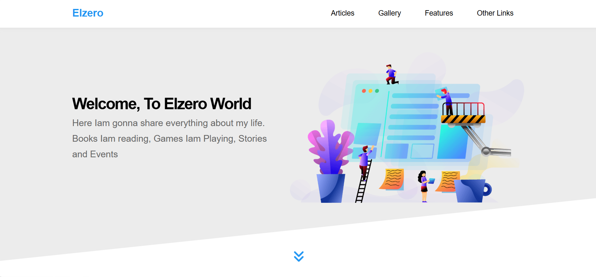

# elzero-template
A modern responsive multi-section website built using HTML, CSS, and JavaScript. This project is based on Elzero Web School template and includes multiple sections like articles, gallery, features, services, and more.
# Elzero Template

## 📌 Overview
This is a modern and fully responsive website built using HTML and CSS.  
It is part of Elzero Web School training projects aimed at improving front-end development skills and mastering responsive layouts.

---

## ✨ Features
- Fully responsive design for all devices  
- Clean and modern UI  
- Multiple sections (Articles, Gallery, Features, Services, Team, Skills, Pricing, Events, Contact)  
- Smooth navigation with anchor links  
- Organized and structured code  

---

## 🛠️ Technologies Used
- HTML5  
- CSS3  
- Font Awesome  
- Google Fonts  

---

## 📷 Preview

---

## 🚀 Live Demo
(https://mahmoudkourd2004-prog.github.io/elzero-template/)

---

## 📁 How to Use
1. Clone the repository  
2. Open `index.html` in your browser  
3. Enjoy the website  

---

## 👨‍💻 Author
Mahmoud Elkourd
